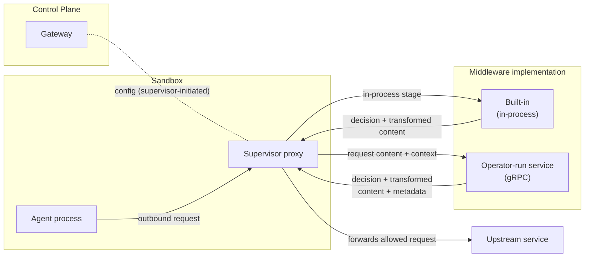
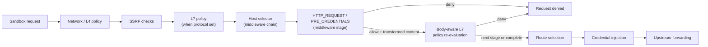

---
authors:
  - "@pimlock"
state: accepted
links:
  - https://github.com/NVIDIA/OpenShell/issues/1043
  - https://github.com/NVIDIA/OpenShell/issues/1733
  - https://github.com/NVIDIA/OpenShell/issues/1734
  - https://github.com/NVIDIA/OpenShell/issues/1919
  - https://github.com/NVIDIA/OpenShell/issues/2010
  - https://github.com/NVIDIA/OpenShell/pull/2027
---

# RFC 0009 - Supervisor Middleware

## Summary

This RFC proposes the introduction of supervisor middleware: a supervisor-side extension system for hooks that can inspect, transform, block, and annotate supervisor-managed operations at specific operation phases. The first hook family is supervisor egress middleware for outbound sandbox HTTP requests, but the framework is intentionally named and shaped so later supervisor hooks can cover other protocols or supervisor operations without renaming the feature.

## Motivation

OpenShell already controls *where* a sandbox can connect. The supervisor enforces network policy on every outbound connection and only allows egress to approved endpoints. Today, that control stops at the destination: once a connection is allowed, the request can carry any payload. Network policy can decide whether a sandbox may talk to `api.openai.com`, but it cannot decide whether a particular request to `api.openai.com` should be allowed based on what that request contains.

Users have a need to control the content that leaves the sandbox. Agents routinely send prompts, tool arguments, uploaded files, which may contain sensitive information. Acting on that traffic, requires inspecting the request itself (e.g. redacting PII or secrets before they leave the sandbox, blocking requests that carry confidential documents, requiring sensitive content to be processed by a local model).

This RFC introduces supervisor middleware and its first hook family, supervisor egress middleware: hooks that run within the supervisor proxy flow and can inspect, transform, block, and annotate outbound requests based on their content. Rather than building a fixed set of content checks into OpenShell, the middleware contract lets operators process selected requests through trusted services that implement their own logic. OpenShell cannot embed every useful detection and transformation approach. We want to allow dedicated PII tools such as Presidio or NeMo Anonymizer, organization-specific classifiers, and experimental research scanners to be plugged in. A stable contract lets teams and researchers iterate on different implementations without changing OpenShell itself.

OpenShell may still ship first-party middleware for a small number of operations where it makes sense. First-party middleware uses the same request-processing model where possible, but restricted hooks may expose supervisor-only host capabilities that external middleware can never receive.

### Use-case: Privacy Guard

Privacy Guard is the motivating use case for this RFC. It is middleware that inspects outbound request content for sensitive data and applies a mitigation before the request leaves the sandbox. We use it throughout this document as a concrete example because it exercises every property the contract needs: policy-controlled placement in the proxy flow, an external service configuration, a request/response contract, failure behavior, and audit-safe findings.

Consider an agent configured with a cloud model. The operator wants uploaded images to never reach that model. With supervisor middleware, they configure Privacy Guard on requests bound for the model endpoint. When the agent uploads an image and asks the model about it, the middleware inspects the request content, detects the image, and redacts it - replacing it with a placeholder (for example, `image upload is disabled for this model`) before the request leaves the sandbox.

Beyond redaction, middleware also produces structured findings and string metadata about a request. That metadata is only an annotation surface in v1; the model-router work will define any routing-grade typed contract later.

## Non-goals

- **Model routing.** This RFC defines the v1 string metadata that middleware can emit, but not the component that consumes findings or metadata to pick a model. Routing a request to a different model based on findings is a separate concern tracked in [#1734](https://github.com/NVIDIA/OpenShell/issues/1734). Here we only avoid blocking a future routing contract: v1 middleware decisions stay `allow`/`deny`, and any later route-selection hook should be limited to OpenShell-managed routes rather than arbitrary rewrites from one external endpoint to another.
- **A general-purpose OpenShell plugin framework.** The first version targets supervisor-owned request processing, beginning with outbound HTTP requests in the supervisor proxy flow. It is not an arbitrary plugin system for every extension point in OpenShell, and it does not cover gateway control-plane hooks, compute driver behavior, or non-supervisor extension points.
- **Constraining or sandboxing the middleware itself.** A middleware gets raw access to request content. OpenShell routes payloads to a service the operator chose to trust; it does not sandbox the middleware, verify its behavior, or prevent a malicious one from mishandling the data it inspects. Authenticated encrypted transport protects the connection but does not make the service trustworthy. Stronger service isolation, such as running middleware in its own sandbox, remains follow-up work.
- **Runtime management of middleware.** Middleware is declared in gateway configuration. A runtime CLI or API to add, list, or validate middleware - and ergonomic tooling to make registration easy, such as a dedicated command or an agent skill that scaffolds and registers a new service - is deferred to follow-up work once the contract stabilizes.
- **Guaranteeing detection correctness.** OpenShell places the hook and enforces the decision the middleware returns, but it does not guarantee that a middleware actually catches all sensitive content. Detection quality is the middleware's responsibility.
- **Support for every deployment mode.** The first version supports in-process built-ins and statically registered external middleware services. Other shapes such as WASM middleware, OpenShell-managed images, sidecars, and running middleware inside its own sandbox are not designed in this RFC. They remain explicitly open for later evaluation rather than being baked into the initial contract. See [appendices/deployment-options.md](appendices/deployment-options.md).

## Terminology

This RFC uses the following terms with specific meanings.

- **Egress.** An outbound request a sandbox sends to an upstream destination through the supervisor proxy. The v1 middleware hook acts on the parsed request the supervisor has already admitted and is about to forward, not on raw packets or arbitrary network activity.
- **Middleware.** A service that inspects, transforms, blocks, or annotates supervisor operations through the contract defined in this RFC. In the v1 egress hook, a middleware owns its detection and transformation logic and never makes the upstream call itself; the supervisor always owns the upstream call.
- **Registered middleware.** An external middleware service an operator declares in gateway configuration as a diagnostic name plus a gRPC endpoint. Registration is an administrative action that establishes which endpoints may receive raw request content. The service exposes stable binding IDs through `Describe`, and policy refers to those binding IDs rather than to the registration name.
- **Built-in middleware.** A middleware that ships inside the supervisor binary and runs in-process, with no network hop and no gateway registration. Built-in binding IDs use the reserved `openshell/` namespace, for example `openshell/regex`.
- **Operation.** The typed method plus typed phase that identifies the point where OpenShell invokes middleware. This RFC's v1 middleware evaluates `method=HTTP_REQUEST, phase=PRE_CREDENTIALS`.
- **Hook.** A named middleware API contract for one operation. Middleware hook names are part of the middleware API, not arbitrary strings supplied by the caller. The v1 hook is `HTTP_REQUEST/PRE_CREDENTIALS`, which runs in the HTTP relay once the request is parsed and admitted by policy and before credential injection. The design allows more typed operations later without changing the v1 hook's request shape.
- **Evaluation.** One invocation of middleware for a specific operation, request context, bounded body, and middleware config. Middleware keeps operation-specific methods such as `EvaluateHttpRequest` because inputs and outputs differ by protocol or operation type.
- **Result.** The response to an evaluation. For the v1 HTTP request hook, the result carries an allow/deny decision, optional replacement content and safe header mutations, findings, metadata, and safe error information.
- **Middleware config.** A policy entry stored under a stable policy-local map key that namespaces metadata and diagnostics. The optional `name` field is a human-readable label and defaults to the map key. The `middleware` field binds the entry to a service-owned binding ID, while the remaining fields define service-specific configuration, endpoint selectors, failure behavior, and ordering.
- **Manifest.** The self-description a middleware returns from `Describe`: its service version and service-owned bindings for the hooks it supports. The protobuf package `openshell.middleware.v1` defines the wire-version boundary; requests and manifests do not carry a duplicate API-version string.
- **Decision.** The allow-or-deny outcome a middleware returns for a request. `allow` lets the request proceed (possibly transformed); `deny` short-circuits it. This vocabulary matches the rest of the OpenShell policy system.
- **Failure policy.** The configured `on_error` behavior when middleware cannot return a valid result: `fail_closed` denies the request, while `fail_open` lets it continue without that middleware's transformation while recording an enforcement failure. `fail_closed` is the default whenever processing is required.
- **Transformation.** A middleware returning replacement content, and any allowed header mutations, that the supervisor forwards in place of the original request. A later middleware in a chain sees the previous stage's transformed content.
- **Finding.** A structured, audit-safe observation a middleware reports about a request, such as a machine-readable type, safe label, count, confidence, and optional severity. A finding never carries raw matched values, redacted spans, or the original sensitive content. The supervisor maps findings into OCSF `DetectionFinding` events.
- **Metadata.** Namespaced string key/value annotations a middleware emits into a request-local bag. V1 metadata never carries raw sensitive values. Routing-grade typed metadata, including usage markers such as audit-safe, routing-safe, or internal-only, is deferred until a component consumes it.
- **Chain.** The ordered set of middleware configs that applies to a single request. Each config runs in turn, a later stage sees the previous stage's transformed content, a `deny` short-circuits the remaining stages, and each matching config runs at most once per request.

## Proposal

The first version makes supervisor middleware concrete through one egress hook family without prematurely standardizing every future deployment model. It supports first-party built-ins that run inside the supervisor and external services that the operator runs and statically registers. OpenShell routes selected egress through the resulting chain, and each stage returns a decision plus optional transformed content, findings, and metadata. This keeps the first iteration focused on the contract, failure behavior, and sandbox integration while leaving other deployment shapes open (see [appendices/deployment-options.md](appendices/deployment-options.md)).

External middleware services are exposed over gRPC network endpoints. The stable contract requires authenticated encrypted transport; phase 1 alone may explicitly opt into plaintext for trusted local or isolated research environments, and phase 2 removes that exception. See [appendices/protocol-extensions.md](appendices/protocol-extensions.md#middleware-authentication).

### Architecture

Three components participate:

- **Gateway (control plane).** Registers middleware, validates that each registered service supports the policies that reference it, and distributes the effective middleware configuration to supervisors. The gateway never sees live request bodies; it stays off the hot path.
- **Supervisor proxy (data plane).** Calls the middleware on the request hot path, enforces the returned decision, forwards only the content the middleware returns, and carries emitted metadata forward. The supervisor owns the upstream call.
- **Middleware implementation.** Inspects the request and returns a decision, optional transformed content, findings, and metadata. A middleware can be a first-party built-in installed in-process or an operator-run service reached over gRPC. Both use the same chain and result semantics and never make the upstream call. Restricted built-ins may access supervisor-only capabilities unavailable to external services.



### Operation phases and placement

A middleware service provides hook implementations that the supervisor invokes at defined operation phases in the proxy flow. This version defines a single typed middleware operation, `HTTP_REQUEST/PRE_CREDENTIALS`, and is structured so more operations can be added later. The supervisor invokes the hook in the HTTP relay once the request has been parsed and admitted by policy, and before OpenShell injects upstream credentials.



This ordering is deliberate:

- Network policy (and L7 policy, where the endpoint declares a `protocol`) runs first, so OpenShell never sends already-denied traffic to a middleware service.
- Middleware selection uses the admitted request host and is independent of which user, provider, or merged network rule admitted the request. This gives the effective policy one stable selection model after policy composition.
- Middleware runs before credential injection, so a middleware never receives OpenShell-managed upstream credentials.
- After a stage replaces the request body, OpenShell re-evaluates body-aware GraphQL, JSON-RPC, or MCP policy before invoking the next stage or forwarding upstream. A policy evaluation error or an unparseable replacement is a hard denial. An enforced policy denial stops and denies. In audit mode, OpenShell records the denial, stops the remaining middleware chain, and forwards the transformed request.
- A middleware's explicit denial and `fail_closed` behavior are enforcement decisions in their own right and remain blocking even when the network endpoint uses `enforcement: audit`.
- Route selection - choosing which upstream, and in future which model, serves the request - runs after the hook, so the later model-router work has a clear handoff point for any middleware findings or metadata it chooses to consume. There is no model router in v1; this box marks where one would plug in. Middleware does not forward traffic itself, and v1 deliberately has no `forward_to` decision. Any later route-selection phase should return an OpenShell-owned route decision for managed destinations, not an arbitrary rewrite from one external endpoint to another.
- The upstream call stays owned by the supervisor, never the middleware.

The hook operates on a parsed HTTP request, so it runs wherever OpenShell can parse one. The supervisor proxy TLS-terminates and HTTP-parses every egress connection that is not marked `tls: skip` and is not opaque, non-HTTP traffic, so the hook fires on those requests regardless of whether the endpoint also declares a `protocol`. Declaring a `protocol` additionally subjects the request to L7 Rego policy; an endpoint without one is still terminated and parsed and the middleware hook runs on it. The only traffic the hook cannot inspect is traffic OpenShell never parses: `tls: skip` endpoints and opaque TCP or TLS passthrough. Policy validation rejects any middleware selector whose possible hosts overlap an endpoint configured with `tls: skip`, so selector-based middleware cannot be silently bypassed by an unparsed path.

If matching middleware exists but a request becomes uninspectable at runtime, OpenShell examines the whole matching chain. If any stage is `fail_closed`, the request is denied. If every matching stage is `fail_open`, OpenShell relays the request and emits a bypass `DetectionFinding`. This chain-level rule prevents one permissive stage from overriding a required stage.

WebSocket sits on this boundary. The upgrade request is a normal HTTP/1.1 request that the hook can inspect, allow, or deny, but the frames exchanged after the connection upgrades are out of scope for v1 (a later `message.*` hook may cover them). To keep the v1 boundary unambiguous:

**In scope for v1:**

- Inspectable HTTP/1.x requests that OpenShell terminates and parses, after L4 and SSRF admit them (and L7 policy too, where the endpoint declares a `protocol`).
- WebSocket upgrade (handshake) requests - the HTTP request that initiates the upgrade.
- Bounded request bodies: a `Content-Length` or bounded chunked body OpenShell can buffer within the applicable chain cap.
- Safe metadata output for later routing or audit.

**Out of scope for v1:**

- HTTP/2 and HTTP/3. The proxy's TLS termination pins ALPN to `http/1.1` today, so these are not introspected.
- Post-upgrade WebSocket frames, and response-body scanning.
- Opaque TCP streams and endpoints with `tls: skip`.
- Unbounded streaming uploads or full-duplex request processing.
- Multipart or compressed body semantics, unless a selected service's manifest and policy explicitly support them within the size limits.

The request hook is synchronous and runs once for every selected stage. Timeout, failure behavior, and body buffering are therefore load-bearing parts of the design. The supervisor buffers up to the largest resolved stage limit, bounded by the 4 MiB platform maximum. A stage whose smaller limit is exceeded applies its own `on_error`, and later stages may still run when that result is `fail_open`. If an oversized `Content-Length` is known before body consumption, the supervisor may preserve streaming and fail open only when every affected stage permits it. If a chunked body crosses the cap after bytes have been consumed, the request is denied because the raw stream can no longer be resumed safely. The hook remains before any credential rewrite, which keeps OpenShell-managed credentials away from external middleware. Other operation phases such as pre-policy classification, a credential-visible `HttpRequest/post_credentials` hook for request signing (built-in-only, for example `openshell/sigv4`), response inspection, route selection for OpenShell-managed destinations, and streaming message hooks are possible future extensions and are out of scope for v1.

### The middleware contract

The contract has two parts: a configuration-time handshake and a request-time evaluation. The evaluation runs on the *hot path* - the synchronous, per-request path through the supervisor proxy, as opposed to the control-plane path used to fetch config. Middleware only sits on this path for sandboxes whose policy configures it: a sandbox with no middleware in its policy is unaffected and pays no per-request cost. Middleware is therefore an explicit opt-in, and this change is transparent to existing usage.

Configuration-time:

- `Describe` reports a service-provided diagnostic name, service version, and service-owned bindings for the typed operation and phase pairs it supports. A binding includes its maximum accepted body size and may override the service RPC timeout.
- `ValidateConfig` lets the service validate its own service-specific configuration fragment.

Request-time:

- `EvaluateHttpRequest` carries the selected binding ID and typed operation phase (`PRE_CREDENTIALS`) plus the request context, middleware configuration from policy, HTTP request target, repeated safe headers in wire order, and bounded body.
- `HttpRequestResult` is a response OpenShell can apply directly: `allow` or `deny`, a reason, optional replacement content, ordered header mutations, findings, and namespaced metadata.

A simplified sketch of the gRPC contract:

```protobuf
service SupervisorMiddleware {
  // Configuration-time
  rpc Describe(google.protobuf.Empty) returns (MiddlewareManifest);
  rpc ValidateConfig(ValidateConfigRequest) returns (ValidateConfigResponse);

  // operation=HTTP_REQUEST, phase=PRE_CREDENTIALS.
  rpc EvaluateHttpRequest(HttpRequestEvaluation) returns (HttpRequestResult);
}

message MiddlewareManifest {
  string name = 1;                      // service-provided diagnostic name
  string service_version = 2;           // service implementation version, informational
  repeated MiddlewareBinding bindings = 3;
}

message MiddlewareBinding {
  string id = 1;                        // service-owned stable ID
  SupervisorMiddlewareOperation operation = 2;
  SupervisorMiddlewarePhase phase = 3;
  uint64 max_body_bytes = 4;
  string timeout = 5;                   // optional binding-specific RPC timeout
}

message HttpRequestEvaluation {
  string binding_id = 1;                // selected manifest binding
  SupervisorMiddlewarePhase phase = 2;

  RequestContext context = 3;
  google.protobuf.Struct config = 4;    // service-specific, from policy

  HttpRequestTarget target = 5;
  repeated HttpHeader headers = 6;      // safe subset, duplicates and wire order preserved
  bytes body = 7;                       // bounded
}

message RequestContext {
  string request_id = 1;
  string sandbox_id = 2;
  Process originating_process = 3;      // optional, per-connection
}

message HttpRequestTarget {
  string scheme = 1;
  string host = 2;
  uint32 port = 3;
  string method = 4;
  string path = 5;
  string query = 6;                     // raw request query string; never log
}

// Mirrors the originating process OpenShell already resolves for network policy and OCSF audit.
message Process {
  string binary = 1;                    // resolved binary path
  uint32 pid = 2;
  repeated string ancestors = 3;        // ancestor binary paths from the process-tree walk
}

message Finding {
  string type = 1;                       // e.g. "pii.email"
  string label = 2;                      // safe display label
  uint32 count = 3;                      // number of matches, never raw values
  string confidence = 4;                 // service-defined confidence marker
  string severity = 5;                   // service-defined severity marker
}

message HttpHeader {
  string name = 1;
  string value = 2;
}

message HeaderMutation {
  oneof operation {
    WriteHeader write = 1;
    RemoveHeader remove = 2;
  }
}

message WriteHeader {
  string name = 1;
  string value = 2;
  ExistingHeaderAction on_existing = 3; // APPEND, OVERWRITE, or SKIP
}

message RemoveHeader {
  string name = 1;
}

message HttpRequestResult {
  Decision decision = 1;                // ALLOW or DENY
  string reason = 2;                    // normalized by OpenShell before security output

  bytes body = 3;                       // replacement content when transformed
  bool has_body = 4;                    // distinguishes no replacement from an empty replacement

  repeated HeaderMutation header_mutations = 5;
  repeated Finding findings = 6;
  map<string, string> metadata = 7;
}
```

The evaluation and result are shaped so middleware composes cleanly in a chain. The allow/deny decision is a first-class result field rather than being mixed into content. If `has_body` is true, the transformed content a middleware returns (`HttpRequestResult.body`) becomes the request body the next middleware receives as `HttpRequestEvaluation.body`; if `has_body` is false, the supervisor keeps the previous body. The supervisor also feeds allowed header mutations into the next stage, so a chain is effectively a fold over a single request representation; a `deny` from any stage short-circuits the rest. See [Middleware ordering](#middleware-ordering) for how chains are assembled and ordered.

Headers use a repeated representation so duplicate lines and wire order survive evaluation and chaining. Before an external call, OpenShell omits credential-bearing, routing, framing, hop-by-hop, and `Connection`-nominated headers. A result may return ordered writes and removals. Writes support append, overwrite, and skip modes but may target only the `x-openshell-middleware-*` namespace. Removals may target other headers visible to middleware, except credential-bearing, routing, framing, hop-by-hop, and `Connection`-nominated headers. Header values containing control characters are invalid. OpenShell validates and applies a stage's mutations atomically. If any mutation is invalid, none are applied and the stage follows its configured `on_error` behavior.

The interface is gRPC. The protobuf package `openshell.middleware.v1` is the protocol version boundary, so manifests and evaluation messages do not repeat an API-version string. The hot-path v1 RPC is unary: the supervisor buffers the bounded body, sends one `HttpRequestEvaluation`, and receives one `HttpRequestResult`. Streaming is deliberately not baked into `EvaluateHttpRequest`; if OpenShell later needs chunked or incremental processing, it should add a separate operation-specific method rather than changing the v1 method cardinality. Possible extensions are collected in the [protocol-extensions appendix](appendices/protocol-extensions.md). Built-in middleware uses the same logical contract in-process with no network hop.

V1 applies explicit public envelope limits before invoking a service or accepting its result: 64 KiB for encoded config, 4 KiB for request context, 32 KiB for the target, 128 header lines and 64 KiB of encoded headers, 4 MiB for the body, 4 KiB for a reason, 64 header mutations with at most 32 KiB of validated name/value data and 64 KiB encoded, 32 findings per stage with each finding at most 4 KiB encoded, and 64 metadata entries totaling at most 32 KiB. A chain has at most 10 stages and therefore at most 320 findings. Middleware gRPC servers configure request and response message limits to cover the 4 MiB body plus at least 292 KiB for the remaining envelope.

The `originating_process` is the same identity OpenShell resolves on the egress path - the binary, pid, and ancestor chain it uses for binary-scoped network policy and OCSF audit. It is per-connection rather than strictly per-request and is optional. Middleware must treat missing process data as unavailable rather than as an authorization failure. The initial implementation leaves this field unset until reliable propagation is available.

### Relationship to RFC 0010

[RFC 0010](https://github.com/NVIDIA/OpenShell/pull/1927) defines gateway interceptors: gateway control-plane extensions that evaluate gateway RPCs such as `CreateSandbox`. This RFC defines supervisor middleware: supervisor data-plane extensions that evaluate supervisor-managed operations such as `HTTP_REQUEST/PRE_CREDENTIALS`. The feature names may differ because the API surfaces and mechanics differ, but the two extension systems should align on shared plumbing where doing so avoids duplicate infrastructure.

Shared mechanics:

- **Endpoint exposure and auth.** Both extension systems use gRPC network endpoints. Their stable transport contract requires confidentiality and service authentication. During phase 1 only, supervisor middleware may explicitly opt into plaintext for trusted local or isolated research environments. Endpoint declaration, identity binding, credential material, and rotation should use shared mechanics where practical.
- **Manifest description.** Both extension systems use `Describe` to return a manifest that declares a diagnostic service name, implementation version, and service-owned bindings for supported hook points.
- **Operation phases.** Both systems hook into a named operation plus phase. The phase sets differ by system, but the concept is the same: `method=CreateSandbox, phase=pre_request` for a gateway interceptor, and `HTTP_REQUEST/PRE_CREDENTIALS` for v1 supervisor middleware.
- **Evaluation and result.** Both systems run an evaluate-style request and return a result. Middleware keeps operation-specific methods such as `EvaluateHttpRequest` because inputs and outputs differ by protocol or operation type; interceptor methods and messages are defined by RFC 0010.
- **Failure policy.** Both systems use `on_error: fail_closed|fail_open`, with fail-closed as the safe default for required enforcement.
- **Observability.** Both systems emit OCSF events with the details relevant to the extension point, while preserving the same no-secrets logging rules.
- **Ordering.** Both systems apply multiple configured extensions in deterministic order.

Intentional differences:

- **Selection model.** Supervisor middleware is selected per sandbox at runtime through policy and API state. Gateway interceptors are selected for the gateway at deploy time by operators in `gateway.toml`.
- **Method naming.** Gateway interceptors register against RPC method strings that are not themselves part of the interceptor API. Supervisor middleware exposes named operation-specific hook methods such as `EvaluateHttpRequest`; those names are part of the middleware API contract.
- **Control responsibility.** Gateway interceptors may enforce that sandbox requests include approved middleware configuration, but they do not replace the per-sandbox middleware selection model.

### Contract versioning

The middleware gRPC contract lives under a major-versioned protobuf package (`openshell.middleware.v1`), the same convention the compute-driver contract uses in [RFC 0001](../0001-core-architecture/README.md). Within a stable major version, changes stay additive and backward compatible - new fields, RPCs, operation phases, and manifest fields can be added - while breaking wire or semantic changes require a new major version. The research preview may still make intentional breaking changes before the contract is declared stable.

The protobuf package is the wire-version handshake. `Describe` reports a diagnostic service name, implementation version, and stable binding IDs for supported hook points; it does not carry a second API-version field. Manifest validation is mandatory: if OpenShell cannot fetch the manifest, bindings conflict, a service claims the reserved `openshell/` namespace, or policy asks for an unsupported binding or invalid config, the gateway rejects the relevant configuration before traffic can depend on it. Runtime invocation failures are handled through `on_error` and use `fail_closed` by default.

### Registration and delivery

The operator registers available external middleware services in gateway configuration under `openshell.supervisor.middleware`. The namespace identifies the subsystem whose behavior is extended, not the process that reads the configuration. The gateway still loads, validates, and distributes these registrations to supervisors. Each entry has a diagnostic name, gRPC endpoint, maximum body size, optional RPC timeout, and transport settings. The diagnostic name identifies the configured connection in logs but is not a policy key. Policy authors select stable binding IDs returned by `Describe`, so they cannot point traffic at an arbitrary endpoint and do not depend on an operator-local registration name.

The v1 transport is gRPC over a network endpoint reachable from every supervisor across Docker, Podman, VM, and Kubernetes drivers. In local single-player deployments, a loopback endpoint such as `127.0.0.1:1234` may be translated to `host.openshell.internal` so a supervisor can reach a service running on the local host. That loopback shorthand is not an HA deployment model: Kubernetes and other shared deployments should register a routable service DNS name or address that every supervisor can reach directly. Other deployment shapes are deferred until OpenShell has a universal way to make those endpoints reachable from the relevant supervisor environments.

```toml
[[openshell.supervisor.middleware]]
name = "anonymizer"
grpc_endpoint = "http://127.0.0.1:1234"
max_body_bytes = 4194304
timeout = "500ms"
allow_insecure = true

[[openshell.supervisor.middleware]]
name = "agent-traces-exporter"
grpc_endpoint = "https://middleware.example.internal:443"
max_body_bytes = 1048576
```

The stable transport requirement is confidentiality plus authentication of the intended middleware service. Phase 1 may temporarily accept a plaintext `http://` endpoint only when the same entry explicitly sets `allow_insecure = true`. OpenShell rejects plaintext without that opt-in, warns prominently, and records the insecure registration as auditable configuration state. This escape hatch is limited to trusted local development and isolated research environments. Phase 2 removes plaintext support and the `allow_insecure` field, requiring authenticated encrypted transport. That removal is an intentional research-preview breaking change with no long-term compatibility obligation. The exact phase 2 mechanism, such as mTLS or TLS plus explicit caller authentication, is follow-up protocol work (see [appendices/protocol-extensions.md](appendices/protocol-extensions.md#middleware-authentication)).

For each binding, the operator's `max_body_bytes` must not exceed the binding capability returned by `Describe` or the 4 MiB platform maximum. The gateway rejects an invalid registration rather than silently clamping it. The resulting operator limit applies to every binding exposed by that registration.

RPC timeouts use an integer with an `ms` or `s` suffix, range from 10 ms through 30 s, and default to 500 ms. A binding may advertise its own timeout through `Describe`; that value overrides the service registration timeout. The service timeout applies to `Describe`, while the effective binding timeout applies to `ValidateConfig` and `EvaluateHttpRequest`.

The external-service endpoint is trusted operator infrastructure in v1. The auth design must make both directions explicit: the supervisor proves to the middleware that the call is authorized for the specific middleware identity, and the supervisor verifies it is calling the intended middleware service.

Binding IDs may be bare (`anonymizer`) or namespaced with `/` (`nvidia/anonymizer`, `acme/security/pii-redactor`). Empty path segments are invalid, so `/foo`, `foo/`, and `foo//bar` are rejected. The `openshell/` namespace is reserved for built-in OpenShell middleware, such as `openshell/regex` or `openshell/sigv4`. Policy config map keys remain stable local identities for metadata namespacing and diagnostics; the `middleware` field selects the binding.

Built-in middleware ships in the supervisor binary and needs no external registration. Supervisors install built-in bindings before attempting external connections.

At gateway startup, OpenShell connects to every registered service and calls `Describe`. Startup rejects unavailable or invalid services, duplicate binding IDs across services, and external claims in the reserved `openshell/` namespace. Sandbox policy creation and update call the owning service's `ValidateConfig` before persistence.

Supervisors receive policy plus the external service registrations required by the effective policy through the existing `GetSandboxConfig` response. Built-in registrations are not delivered because they are already installed in-process. The gateway stays off the request hot path; supervisors connect to the required services and invoke them directly.

Runtime changes are prepared off to the side. Policy and middleware registry swap as one generation only after the complete candidate is ready. A policy-only update reuses an already connected registry. If preparation fails, the supervisor preserves the complete last-known-good runtime and continues retrying. If an external service is unavailable when a supervisor starts or reloads, built-ins remain active, requests use each selected config's `on_error`, and a polling loop retries the service independently of policy revision changes.

Middleware registration lives in gateway configuration, which is not hot-reloaded ([RFC 0003](../0003-gateway-configuration/README.md) lists this as a non-goal): changing the registered set requires restarting the gateway. Middleware selection is separate from registration. Registration declares what implementations are available to supervisors; per-sandbox policy and API updates decide which middleware configs apply to a given sandbox at runtime. On restart, supervisors re-sync the effective configuration over their existing connection, so running sandboxes pick up a newly added middleware rather than only newly created sandboxes seeing it - there is no per-sandbox snapshot of the registered set.

Removing a registered middleware that an active policy config still binds to causes those sandboxes to follow the affected config's `on_error`; `fail_closed` is the default. For now, the operator is responsible for removing policy configs before removing the registration. Runtime process or network failures follow the same rule while the supervisor retries the connection.

V1 does not define a separate health-check RPC. Connection establishment, `Describe`, per-request invocation, timeout, `on_error`, and the registry retry loop provide the required availability behavior. A dedicated health API may improve alerting later but is not required for correctness.

Multitenancy is handled by OpenShell policy selection, not by giving middleware its own tenant-routing model. A shared middleware service may receive requests from many sandboxes, but the service should treat `sandbox_id`, policy name, and endpoint context as audit context only unless a later OpenShell domain object defines stronger grouping semantics. Middleware-specific tenant grouping is possible but not part of the OpenShell contract.

### Policy integration

Policy decides which middleware runs for which traffic, how it is configured, and what happens on failure. Middleware configs live once in the top-level `network_middlewares` map, represented as `map<string, NetworkMiddlewareConfig>` in `SandboxPolicy`. Each map key is the stable policy-local identity. Each config selects destination hosts directly through `endpoints.include` and `endpoints.exclude`; network policies and endpoints do not carry middleware attachment lists.

A middleware config may include an optional human-readable `name`, which defaults to the map key and does not replace that key as the config identity. `middleware` is the stable binding ID exposed by a built-in or by an external service's `Describe` response. Different map keys may reference the same binding and run as separate stages with different selectors or configuration.

Each entry supplies implementation-owned configuration, `on_error` behavior, numeric `order`, and endpoint selectors. `fail_closed` is the default. `order` defaults to `0` and must be unique across the complete policy, even when selectors do not overlap, so policies with multiple configs normally set it explicitly. OpenShell validates the structure and asks the owning implementation to `ValidateConfig` before the gateway persists a policy.

Selection occurs after network and L7 admission and depends only on the admitted request host. It does not depend on which user-authored, provider-derived, broad, specific, or merged network rule admitted the request. This independence is important because effective policy composition may change the admitting rule without changing the intended content controls.

Every config requires a non-empty `include` list. `exclude` is optional and takes precedence over `include`. Matching is case-insensitive and uses the same host-pattern implementation as network endpoints: `*` matches exactly one DNS label, `**` matches one or more DNS labels, and intra-label wildcards such as `*-api.example.com` are supported. Brace alternates are rejected; authors list each alternative explicitly. A config accepts at most 32 combined include and exclude patterns. A policy accepts at most 10 middleware configs, and runtime selection defensively rejects a chain longer than 10 stages.

The hook is a supervisor-side Rust enforcement stage selected by policy data, not a Rego rule. L4 policy admits the connection and, where the endpoint declares a `protocol`, L7 policy admits the parsed request. The supervisor then selects the chain, buffers the bounded body, invokes stages, applies valid results, and re-evaluates body-aware protocol policy after each body replacement. Request bodies do not otherwise become a new general Rego input surface.

```yaml
network_middlewares:
  regex-redactor:
    name: Redact sensitive tokens
    middleware: openshell/regex
    order: 10
    config:
      mode: redact
    on_error: fail_closed
    endpoints:
      include: ["*.example.com"]
      exclude: ["trusted.example.com"]

  anonymize:
    middleware: acme/anonymizer
    order: 20
    config:
      pii: redact
    on_error: fail_closed
    endpoints:
      include: ["api.example.com"]

  export-traces:
    middleware: acme/trace-exporter
    order: 30
    config:
      exclude_images: true
    on_error: fail_open
    endpoints:
      include: ["api.example.com"]
```

With this policy, a request to `api.example.com` runs `regex-redactor`, `anonymize`, and `export-traces` in that order. A request to `trusted.example.com` does not run `regex-redactor` because exclusion wins. `openshell/regex` is a best-effort example that applies a fixed set of regular-expression replacements to UTF-8 bodies; it is not parser-aware and does not guarantee detection or complete removal of sensitive values. If `anonymize` fails, the request is denied. If `export-traces` fails, the stage is bypassed, the rest of the chain continues, and OpenShell emits a detection finding.

V1 middleware configs are policy-local and are not embedded in provider profiles. Their host selectors run after effective policy assembly, so they cover provider-supplied endpoints without mutating or attaching data to the provider policy. Reusable cross-sandbox middleware profiles and provider-profile opt-ins remain follow-up design work.

### Middleware ordering

When more than one middleware config matches a request, the supervisor sorts them by ascending numeric `order`. Order values must be unique across the policy and duplicate values are rejected during validation. `order` defaults to `0`, so policies with multiple configs normally set explicit values. Each matching config runs once. Different map keys that reference the same binding remain separate stages and may therefore run more than once with distinct configuration.

A later stage sees the earlier stage's accepted body and header mutations. A middleware `deny` short-circuits the chain. A failed `fail_closed` stage also stops and denies. A failed `fail_open` stage leaves the request representation unchanged for that stage, emits a bypass finding, and permits later stages to run.

`before` and `after` constraints are deferred until reusable middleware profiles or cross-policy composition creates a demonstrated need for partial ordering. Implementation-defined ordering is rejected because middleware can transform request content, so operators require deterministic and reviewable behavior.

### Metadata and downstream routing

Beyond allow/deny and transformation, middleware emits string metadata (for example `modalities = "text,image"`, `sensitivity = "restricted"`, `requires_local_model = "true"`) into a request-local metadata bag. The supervisor stores that metadata under the middleware config's stable map key, so `anonymize.sensitivity` and `budget.sensitivity` do not collide even if two services return the same key. V1 metadata is intentionally string-only and never carries raw sensitive values. This gives early middleware a safe annotation surface while deferring routing-grade typed metadata and usage markings to the model-router work; the router itself is out of scope ([#1734](https://github.com/NVIDIA/OpenShell/issues/1734)).

Because `HTTP_REQUEST/PRE_CREDENTIALS` runs before route selection and credential injection, v1 does not guarantee that metadata visible at this hook includes the final routed model or upstream route. Budget-style middleware that needs post-call status, final route/model, content length, or token usage needs a later metadata-only notification hook such as `HttpResponse/completed`; that hook is listed as a future extension in the [protocol-extensions appendix](appendices/protocol-extensions.md#additional-operation-phases), not part of the v1 request hook.

The namespace is the policy-local middleware config map key, not the optional human-readable `name` or the binding ID. This means two configs that use the same binding still produce separate metadata buckets, and changing a display label or the registered service behind a binding does not rename downstream annotations.

### Audit and logging

A middleware decision is observable sandbox behavior, so it is recorded as an OCSF event, consistent with how the supervisor already logs network and L7 enforcement. This RFC commits to the event categories and the safety rules; exact field mappings are an implementation detail.

- **Per-invocation decisions** are `HttpActivity` events, since middleware is an L7 enforcement point. Each stage records the policy-local config key, validated binding ID, decision, transformation state, latency, and policy and endpoint context. Allowed requests are `Informational`; denials are `Medium`.
- **Enforcement failures and bypasses** also emit `DetectionFinding` events. Required-stage failures, invalid responses, uninspectable traffic with a required stage, and body-aware policy evaluation failures are `High`. A `fail_open` bypass and uninspectable traffic allowed because every matching stage is `fail_open` are still findings so operators can alert on reduced enforcement.
- **Configuration events** are `ConfigStateChange` events: middleware registration validation, registry reload success or failure, and policy validation outcome.

These events must never leak the content they describe. The OCSF JSONL may be shipped to external systems, so:

- Raw request content, matched values, redacted spans, and service-config secrets are never logged.
- Built-ins may preserve contract-defined audit-safe reasons and finding fields. Operator-run reason text, finding text, mutation errors, and diagnostic metadata are untrusted input. OpenShell replaces or omits them in denied responses and security logs, using stable platform-owned messages derived from the validated binding and failure category.
- Events carry only safe summaries: policy-local config keys, validated binding IDs, decisions, latency, platform-owned failure categories, and aggregate counts.

This mirrors the middleware response contract, which already forbids the service from returning raw matched values.

## Implementation plan

Supervisor egress middleware stays opt-in throughout: until a policy declares a matching middleware config, no sandbox invokes one and the proxy hot path is unchanged. The initial usable slice proves built-in and external execution together; the phase boundary is transport hardening, not whether external middleware exists.

**Phase 1 - research-preview contract and execution.** Define `openshell.middleware.v1` with `Describe`, `ValidateConfig`, and `EvaluateHttpRequest`; ship the example `openshell/regex` built-in; and support statically registered operator-run services. Policy uses a top-level selector-based `network_middlewares` map with stable config keys, unique numeric `order`, per-stage `on_error`, bounded bodies, bounded RPC timeouts, atomic header mutations, post-transformation policy re-evaluation, and OCSF observability. Gateway startup validates external manifests, policy writes validate implementation-owned config, effective sandbox config carries only required external registrations, and supervisors install policy plus registry as one last-known-good runtime generation. Phase 1 requires encrypted authenticated transport for normal use but temporarily permits plaintext `http://` only with explicit `allow_insecure = true` for trusted local development or isolated research. OpenShell warns and emits auditable configuration state whenever that exception is used.

**Phase 2 - mandatory authenticated encryption.** Remove plaintext middleware transport and remove `allow_insecure`. Every external connection must provide transport confidentiality and authenticate the intended service, with the final mechanism and credential delivery model defined by follow-up protocol work. Because phase 1 is explicitly a research preview, removing its insecure escape hatch is an intentional breaking change and does not create a long-term compatibility obligation. Operator-run service deployment otherwise keeps the same binding, policy, validation, delivery, reload, and invocation model.

### Backwards compatibility and migration

Existing sandbox policies and gateway configs that declare no middleware remain valid and pay no per-request cost. Middleware configs that opt into phase 1 plaintext are intentionally temporary: they must migrate to authenticated encrypted endpoints before phase 2 because `allow_insecure` and plaintext support will be removed. The research-preview contract may make other breaking changes before stability.

### Research preview

The first release is a research preview. The contract, policy surface, and scope are provisional and may change without the usual compatibility guarantees. Plaintext is a phase 1 exception, not part of the stable design. Production and shared deployments must use authenticated encrypted transport, and phase 2 removes the exception entirely (see [appendices/protocol-extensions.md](appendices/protocol-extensions.md#middleware-authentication)). The goal is to validate the contract and operational model through early experiments with a built-in middleware plus a small number of trusted external services before committing to long-term stability.

## Risks

Adding a synchronous, content-aware hook to the egress path has real costs. The most significant:

- **Hot-path latency and a new per-request dependency.** Each selected external stage makes a synchronous call and blocks on its reply, so middleware latency becomes request latency and the service becomes a new failure surface on the data plane. This is bounded by opt-in host selectors, per-middleware timeouts, and built-ins running in-process with no network hop, but for matching traffic the tax is unavoidable.
- **Fail-closed breaks workloads.** Denying traffic when a required middleware is unavailable, times out, or returns a malformed response is the safe default, but it converts a middleware outage into a sandbox outage. The opposite default leaks the very content the middleware exists to control. There is no choice that is both safe and always available; `on_error` makes the tradeoff explicit per middleware, but operators can still pick a default that surprises them.
- **Body buffering and size limits.** Inspecting content means buffering a bounded request body instead of streaming it, which adds memory cost and interacts badly with growing payloads (for example inference requests whose context expands each turn until it exceeds the cap). An over-cap request is treated as an `on_error` event for the middleware that needs the body, so it follows the same `fail_closed` default: it is denied unless the operator has explicitly set `on_error: fail_open` for that middleware. Passing an over-cap request through unprocessed is therefore never the default - it is an opt-in choice made per middleware, and one a security-critical middleware would deliberately leave off so that oversized content is denied rather than silently egressed.
- **No OpenShell-side rate limiting.** OpenShell does not throttle calls to a middleware. A middleware that is slow, overloaded, or unavailable is handled only by its timeout and `on_error`, so operators must size, scale, and protect the service themselves; a struggling middleware degrades every request routed through it.
- **Trusting an unsandboxed service with raw content.** Middleware receives raw request payloads, and OpenShell does not sandbox it, verify its behavior, or prevent it from mishandling or exfiltrating what it inspects. A buggy or malicious middleware is a direct data-exposure path. Trust in the middleware is the operator's responsibility, the same as trust in a sandbox image, but the blast radius here is in-flight request content.
- **A false sense of coverage.** The hook runs only on traffic OpenShell terminates and parses. Opaque TCP or TLS passthrough, encrypted or otherwise opaque bodies, endpoints outside every selector, and content the middleware fails to detect can still leave without effective inspection. Policy validation rejects selector overlap with `tls: skip`, and runtime uninspectability follows the matching chain's failure policy, but detection correctness and traffic outside the selected host set remain inherent limitations.
- **Phase 1 plaintext is risky.** The research-preview exception permits plaintext gRPC only with explicit `allow_insecure = true`. Because middleware can allow, deny, or transform egress, an impersonated or eavesdropped service is a policy-enforcement bypass, not just an observability gap. The exception is unsuitable for shared or untrusted networks, produces an explicit warning and audit event, and is removed in phase 2. See [appendices/protocol-extensions.md](appendices/protocol-extensions.md#middleware-authentication).
- **Added surface to build, version, and maintain.** A new gRPC contract, policy schema, gateway configuration table, and manifest handshake are all long-lived surfaces with compatibility obligations, and middleware chains add ordering semantics operators must reason about. The research-preview framing keeps the contract provisional for now, but the long-term maintenance cost is real and is the main argument for keeping v1 deliberately small.

The cost of *not* doing this is leaving content-level egress control entirely outside OpenShell: operators who need to redact, block, or annotate outbound content based on what it contains would have to build bespoke proxies around the sandbox, losing the policy integration, audit, and trust boundary the supervisor already provides.

## Alternatives

- **Build content checks into OpenShell directly.** A fixed, built-in set of DLP/redaction rules avoids a contract and an external service. Rejected as the primary model: OpenShell cannot embed every useful detection and transformation approach, and a stable contract lets dedicated tools and research scanners iterate without changing OpenShell. First-party built-in middleware still ships for narrow cases, over the same contract.
- **REST instead of gRPC.** A REST/JSON hook is simpler to call, and with OpenAPI it could still offer a manifest handshake and a typed contract. Rejected because gRPC's typing is stronger, OpenShell already uses gRPC across its service contracts, and gRPC leaves room for future streaming operations if large or incremental payload processing becomes necessary. Staying on a single toolchain avoids a second RPC stack to build, secure, and maintain.
- **Other deployment modes (WASM, sidecar, in-sandbox).** In-process WASM filters or sidecars avoid a network hop and can tighten the trust boundary. Deferred rather than rejected: v1 supports native built-ins and statically registered external services, while other shapes remain open. See [appendices/deployment-options.md](appendices/deployment-options.md).
- **Doing nothing.** The cost of declining is covered at the end of Risks: content-level egress control stays outside OpenShell, and operators must build bespoke proxies that lose the policy integration, audit, and trust boundary the supervisor already provides.

## Prior art

Calling an external service from a proxy to inspect, transform, or block in-flight traffic is well-established. The closest analogs:

- **Envoy `ext_proc` (External Processing).** The primary model for this RFC. Envoy streams request headers and body to an external gRPC service that can mutate the body (for example redaction), allow, or deny, and the proxy and the processing service scale independently. Our `HttpRequest/pre_credentials` hook is a buffered, single-hook v1 of the same boundary; if OpenShell later needs `ext_proc`-style streaming, it should add a separate streaming operation.
- **Envoy `ext_authz` (External Authorization).** A narrower sibling: an external service returns an allow/deny decision per request. It validates the "delegate the per-request decision to an external service in the hot path" pattern, without the content-transformation half that this RFC needs.
- **ICAP (RFC 3507).** HTTP proxies offload content adaptation, virus scanning, DLP, and content filtering to external ICAP servers that can modify or block request/response content. It is the closest *functional* precedent for content-aware egress control. Two details map directly onto our design: ICAP supports **pipelining** multiple servers (our middleware chain) and a **content preview** of the first bytes before full processing (our bounded-body buffering). What we avoid is its dated, text-based wire protocol; gRPC gives us typed contracts and room for future operation-specific streaming if we need it.
- **HashiCorp `go-plugin` (Terraform, Vault).** Third-party plugins run as separate processes and communicate with the core exclusively over gRPC. It shows a strictly typed gRPC contract is a robust way to manage cross-language third-party extensions, which informs our registration plus manifest handshake (`Describe`, `ValidateConfig`).
- **Kubernetes CSI / KMS.** Vendor-specific integrations are offloaded to external gRPC services rather than compiled into the core. Same "core defines the contract; integrators implement it out-of-process" split we use for middleware.
- **Proxy-Wasm (Envoy/Istio Wasm filters).** In-process WebAssembly extensions with strong default-deny sandboxing and no IPC latency. Relevant to the future WASM deployment mode (see the deployment-options appendix); set aside for v1 because it is currently weak for GPU-backed or memory-heavy semantic guards.

## Decisions and explicit deferrals

This section closes the current review themes.

### Decisions

- **Middleware naming.** Use the feature name "supervisor middleware." The first operation family is egress middleware, but the higher-level feature name stays extensible for future supervisor hooks. The service can inspect, transform, deny, and annotate, so narrower names such as "transformer" or "request processor" describe only part of the contract.
- **Middleware binding IDs.** Services own stable binding IDs and policy selects them through the `middleware` field. Gateway registration names are diagnostic only. Binding IDs use `/` for namespaces, `openshell/` is reserved for built-ins, and empty path segments are invalid.
- **Operation naming.** Use typed operation and phase enums such as `HTTP_REQUEST/PRE_CREDENTIALS`. The operation describes the middleware API payload, and the phase describes the proxy position. Later protocols can add typed operations such as WebSocket message or TCP connect without renaming the v1 hook.
- **HTTP scope of v1.** `HTTP_REQUEST/PRE_CREDENTIALS` applies to every HTTP/1.x request that OpenShell terminates and parses, whether or not the endpoint declares a `protocol`. WebSocket upgrade requests are included; post-upgrade frames, HTTP/2, HTTP/3, opaque TCP, and `tls: skip` traffic are excluded.
- **Route selection and forwarding.** V1 has no `forward_to` decision. Middleware never makes the upstream call. Future route-selection hooks may choose among OpenShell-managed destinations, such as model routes, but must not become arbitrary external endpoint rewrites.
- **SigV4/request signing.** AWS SigV4 belongs to a restricted built-in `HttpRequest/post_credentials` hook, not external `HttpRequest/pre_credentials` middleware. The middleware can be configured by policy, but it must run in-process with supervisor host capabilities so it can strip placeholder signatures and sign with real supervisor-resolved credentials without exposing those credentials over the external middleware contract.
- **Composability and ordering.** Middleware is chainable and ordered by ascending numeric `order`. Order values must be unique across the policy. A stage receives the previous stage's transformed body and header mutations; `deny` short-circuits the chain; and different config map keys may invoke the same binding as separate stages.
- **Header mutation.** Headers preserve duplicates and wire order. External writes are limited to `x-openshell-middleware-*` and support append, overwrite, or skip. Removes may target other visible headers. Credential-bearing, routing, framing, hop-by-hop, and `Connection`-nominated headers remain protected. Each stage's mutations are atomic.
- **Finding shape.** Findings never include matched values or raw content. Built-ins may provide contract-defined audit-safe labels. Operator-run text and metadata are untrusted and are replaced or omitted in security outputs in favor of validated binding IDs, platform labels, and aggregate counts.
- **Actor data.** Actor process data is optional and per-connection. Middleware must treat it as context, not a reliable per-request identity or authorization input.
- **Metadata namespacing.** Metadata is stored under the policy-local middleware config map key rather than the optional human-readable name. This prevents collisions without a central key registry and lets two configs using the same implementation emit independent metadata.
- **Selector-only placement.** V1 uses only config-level `endpoints.include` and `endpoints.exclude` selectors. Policy-level and endpoint-level attachment lists are not part of the schema. Selection is independent of the network rule that admitted the request and therefore remains stable after effective-policy composition.
- **Failure behavior.** Middleware errors, timeouts, malformed responses, and over-cap bodies use `on_error`; `fail_closed` is the default. Passing unprocessed content through is only possible when the operator explicitly sets `on_error: fail_open`.
- **Limits.** V1 caps policies at 10 middleware configs, selectors at 32 combined patterns per config, bodies at 4 MiB, findings at 32 per stage, and all non-body request and result fields at the public envelope limits in the contract section.
- **Delivery and reload.** `GetSandboxConfig` delivers only external registrations required by the effective policy. Built-ins are installed locally. Supervisors prepare candidate policy and registry state off-path, swap them as one generation, reuse connections for policy-only changes, and preserve the complete last-known-good runtime on failure.
- **Chunked and compressed bodies.** V1 operates on bounded bytes OpenShell can buffer safely. Known over-cap content length may fail open before consumption when every affected stage permits it. Chunked overflow after consumption is denied because the raw stream cannot be resumed. Compressed bodies remain opaque unless a binding explicitly supports them.
- **Post-transformation enforcement.** Every body replacement is re-evaluated by body-aware GraphQL, JSON-RPC, or MCP policy before the next stage or upstream. An enforced denial blocks. In audit mode, a denial is logged, the remaining chain stops, and the transformed request is forwarded. Evaluation failure or an unparseable replacement is a hard denial. Middleware deny and `fail_closed` remain blocking regardless of endpoint audit mode.
- **Trust boundary and phases.** Stable external middleware transport requires confidentiality and service authentication. Phase 1 may temporarily allow plaintext only with explicit `allow_insecure = true`, a warning, and an audit event in trusted local or isolated research environments. Phase 2 removes plaintext and `allow_insecure` as an intentional research-preview breaking change.
- **Multitenancy.** OpenShell controls middleware application through policy selection. A middleware may receive sandbox and policy context for audit, but OpenShell does not define a middleware-owned tenant grouping model in v1.
- **API maturity qualifier.** Use `openshell.middleware.v1`, not `v1alpha1`. The project is already alpha-stage; the RFC labels this contract as a research preview, so an additional per-contract alpha package adds little.

### Explicit deferrals

- **Provider-profile middleware.** V1 middleware configs live in sandbox policy, not provider profiles. Provider-supplied network policies can be targeted after effective policy assembly. Provider-profile opt-ins for built-in middleware such as `openshell/sigv4`, and reusable cross-sandbox middleware profiles, are follow-up design work.
- **Authenticated transport mechanism.** Phase 2 requires authenticated encrypted transport. The exact choice between mTLS, TLS plus caller authentication, or an equivalent mechanism, including credential delivery and rotation, is follow-up protocol work.
- **Health checks.** V1 relies on connection establishment, `Describe`, per-request invocation, timeout, `on_error`, and registry polling. A dedicated health RPC can improve alerting later but is not required for correctness.
- **Registration ergonomics and ownership.** V1 middleware registration is an operator concern: middleware services are declared in gateway configuration and changing the registered set requires a gateway restart. Runtime user-managed registration, CLI/API helpers, SDK helpers, and an agent skill for scaffolding or registering middleware are useful follow-ups after the policy and service contract stabilize.
- **Post-call budget reconciliation.** Budget-style middleware that needs final route/model, status, content length, or token usage needs a metadata-only hook such as `HttpResponse/completed`. That hook is listed as a future extension and is not part of the v1 request hook.
- **Deployment modes and timelines.** V1 commits to externally managed services plus in-process built-ins. WASM, sidecar, OpenShell-managed image, and in-sandbox middleware have no committed timeline in this RFC.
